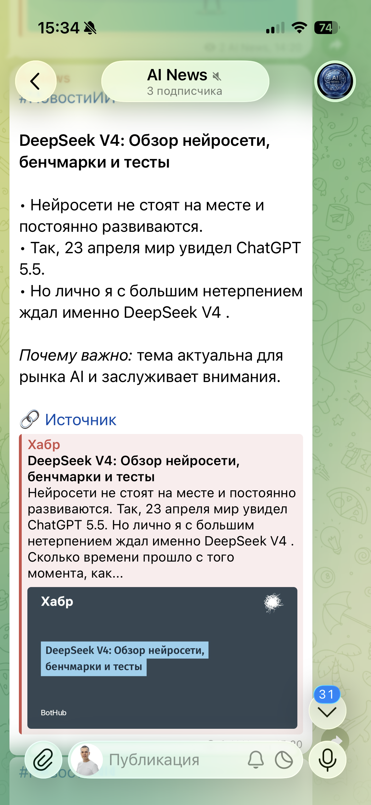
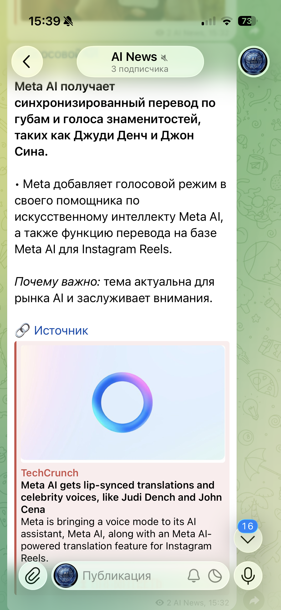

# 📰 AI News Bot

> **Telegram-бот для автоматического мониторинга и публикации новостей об искусственном интеллекте**

[](https://python.org)
[](https://core.telegram.org/bots)
[](https://docker.com)
[](LICENSE)

---

## 📋 Оглавление

- [О проекте](#-о-проекте)
- [Пример поста](#-пример-поста)
- [Возможности](#-возможности)
- [Структура проекта](#-структура-проекта)
- [Быстрый старт](#-быстрый-старт)
- [Переменные окружения](#-переменные-окружения)
- [Деплой через Docker](#-деплой-через-docker)
- [Скриншоты](#-скриншоты)

---

## 🎯 О проекте

**AI News Bot** — автоматический агрегатор новостей об ИИ для Telegram-канала. Бот мониторит актуальные публикации с ведущих технологических площадок (Хабр, TechCrunch и др.), форматирует их в структурированные посты и публикует в канал в едином читаемом стиле.

Цель проекта: держать подписчиков в курсе последних событий рынка AI без необходимости вручную отслеживать множество источников.

---

## 📋 Пример поста

```
DeepSeek V4: Обзор нейросети, бенчмарки и тесты

• Нейросети не стоят на месте и постоянно развиваются.
• Так, 23 апреля мир увидел ChatGPT 5.5.
• Но лично я с большим нетерпением ждал именно DeepSeek V4.

Почему важно: тема актуальна для рынка AI и заслуживает внимания.

🔗 Источник
[Хабр — DeepSeek V4: Обзор нейросети, бенчмарки и тесты]
```

```
Meta AI получает синхронизированный перевод по губам и голоса
знаменитостей, таких как Джуди Денч и Джон Сина.

• Meta добавляет голосовой режим в своего помощника Meta AI,
  а также функцию перевода на базе Meta AI для Instagram Reels.

Почему важно: тема актуальна для рынка AI и заслуживает внимания.

🔗 Источник
[TechCrunch — Meta AI gets lip-synced translations and celebrity voices]
```

---

## ✨ Возможности

- **Мониторинг источников** — автоматический сбор новостей с Хабр, TechCrunch и других площадок
- **Единый формат постов** — структурированный шаблон: заголовок → ключевые тезисы → «Почему важно» → источник
- **Карточки превью** — ссылка на оригинальную статью оформляется с превью (Open Graph)
- **Защита от дублей** — отслеживание уже опубликованных материалов
- **Docker-деплой** — запускается в один контейнер без сложной настройки

---

## 📁 Структура проекта

```
ai-news-bot/
├── main.py              # Точка входа — весь код бота
├── requirements.txt     # Python зависимости
├── Dockerfile           # Docker образ для деплоя
├── .dockerignore        # Исключения для Docker build
├── .gitattributes       # Настройки Git
└── screenshots/         # Скриншоты для документации
    ├── ai-news-bot.PNG
    └── ai-news-bot_2.PNG
```

---

## 🚀 Быстрый старт

### Локальный запуск

```bash
# 1. Клонировать репозиторий
git clone https://github.com/Serge-17/ai-news-bot.git
cd ai-news-bot

# 2. Создать виртуальное окружение
python -m venv .venv
source .venv/bin/activate  # Windows: .venv\Scripts\activate

# 3. Установить зависимости
pip install -r requirements.txt

# 4. Задать переменные окружения
export TELEGRAM_BOT_TOKEN="your_token_here"
export TELEGRAM_CHANNEL_ID="@your_channel"

# 5. Запустить
python main.py
```

---

## 🔑 Переменные окружения

| Переменная | Описание | Где получить |
|-----------|----------|-------------|
| `TELEGRAM_BOT_TOKEN` | Токен Telegram-бота | [@BotFather](https://t.me/BotFather) |
| `TELEGRAM_CHANNEL_ID` | ID или username канала для публикаций | Настройки канала / `@username` |

> **Важно:** бот должен быть добавлен в канал с правами администратора и разрешением на публикацию сообщений.

Создайте файл `.env` в корне проекта:

```env
TELEGRAM_BOT_TOKEN=123456789:ABCdefGHIjklMNOpqrsTUVwxyz
TELEGRAM_CHANNEL_ID=@your_channel_username
```

---

## 🐳 Деплой через Docker

```bash
# Собрать образ
docker build -t ai-news-bot .

# Запустить с переменными окружения
docker run -d \
  --name ai-news-bot \
  --restart unless-stopped \
  -e TELEGRAM_BOT_TOKEN="your_token" \
  -e TELEGRAM_CHANNEL_ID="@your_channel" \
  ai-news-bot
```

Или через `.env` файл:

```bash
docker run -d --env-file .env --restart unless-stopped ai-news-bot
```

---

## 🖼 Скриншоты

<table>
  <tr>
    <td></td>
    <td></td>
  </tr>
</table>

---

## 📄 Лицензия

MIT License — используйте свободно, упоминание автора приветствуется.

---

<div align="center">

Сделано с 🤖 и ☕ | Автор: [Serge-17](https://github.com/Serge-17)

</div>
